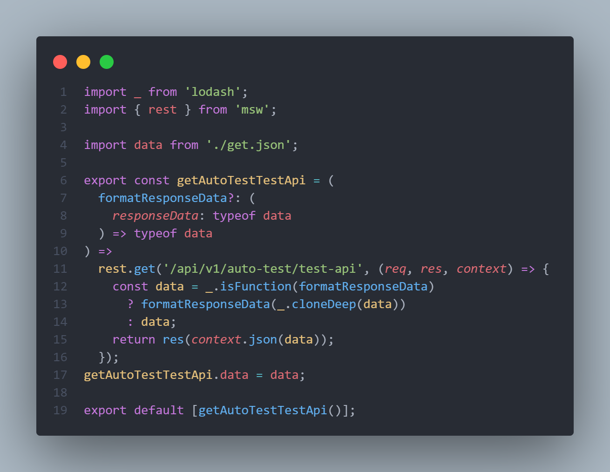

<div align="center"> har-to-api </div>
har-to-api 是一个通过解析浏览器 har 文件生成特定结构格式代码的工具，本人写该工具的初衷是为了摆脱手写 mock 接口的重复性工作。

##### 安装

```typescript
npm i har-to-api --save
```

##### 使用

```typescript
// 配置文件 har-to-api.config.js
module.exports = {
  // 输出的目录
  outPutDir: "./__mocks__/services/",
  template: (option) => {
    const { functionName, method, api, dataName } = option;
    return `import _ from 'lodash';
import { rest } from 'msw';

import ${dataName} from './get.json';

export const ${functionName} = (
  formatResponseData?: (
    responseData: typeof ${dataName}
  ) => typeof ${dataName}
) =>
  rest.${method}('${api}', (req, res, context) => {
    const data = _.isFunction(formatResponseData)
      ? formatResponseData(_.cloneDeep(${dataName}))
      : ${dataName};
    return res(context.json(data));
  });
${functionName}.data = ${dataName};

export default [${functionName}()];
  `;
  },
  // har 文件路径
  harPath: "./*.har",
  prefix: "/api/v1",
};
```

```typescript
npx har-to-api
```

结果



##### 配置详解

| 名称              | 类型 `(默认值)`                                                                          | 描述                                                                                                                                                                                                                                   |
| ----------------- | ---------------------------------------------------------------------------------------- | -------------------------------------------------------------------------------------------------------------------------------------------------------------------------------------------------------------------------------------- |
| outPutDir         | string                                                                                   | 产物输出目录                                                                                                                                                                                                                           |
| template          | (option: {functionName: string, method: string, api: string, dataName: string})=> string | 生成产物的函数                                                                                                                                                                                                                         |
| apiFileExtensions | string`(.ts)`                                                                            | 生成 api 文件的后缀名                                                                                                                                                                                                                  |
| harPath           | string                                                                                   | har 文件地址                                                                                                                                                                                                                           |
| supportMethods    | string[]`([.get])`                                                                       | har 文件中支持的请求类型                                                                                                                                                                                                               |
| cover             | boolean`(false)` &#124; { api: boolean, data: boolean }                                  | 是否覆盖掉已经生成的内容                                                                                                                                                                                                               |
| dynamicApiList    | string[]                                                                                 | `某些接口的路径部分是动态的，对于数字类型的比较好处理，但是对于是字符串类型的就不好处理了，所以提供了这样一个属性。例：dynamicApiList: ["/api/v1/dashboard/scan/:container-name/vulnerabilities"]，这样就能方便的提取出其中动态的部分` |
| prefix            | string`('')`                                                                             | 匹配的接口前缀，生成的方法名不含该前缀                                                                                                                                                                                                 |
